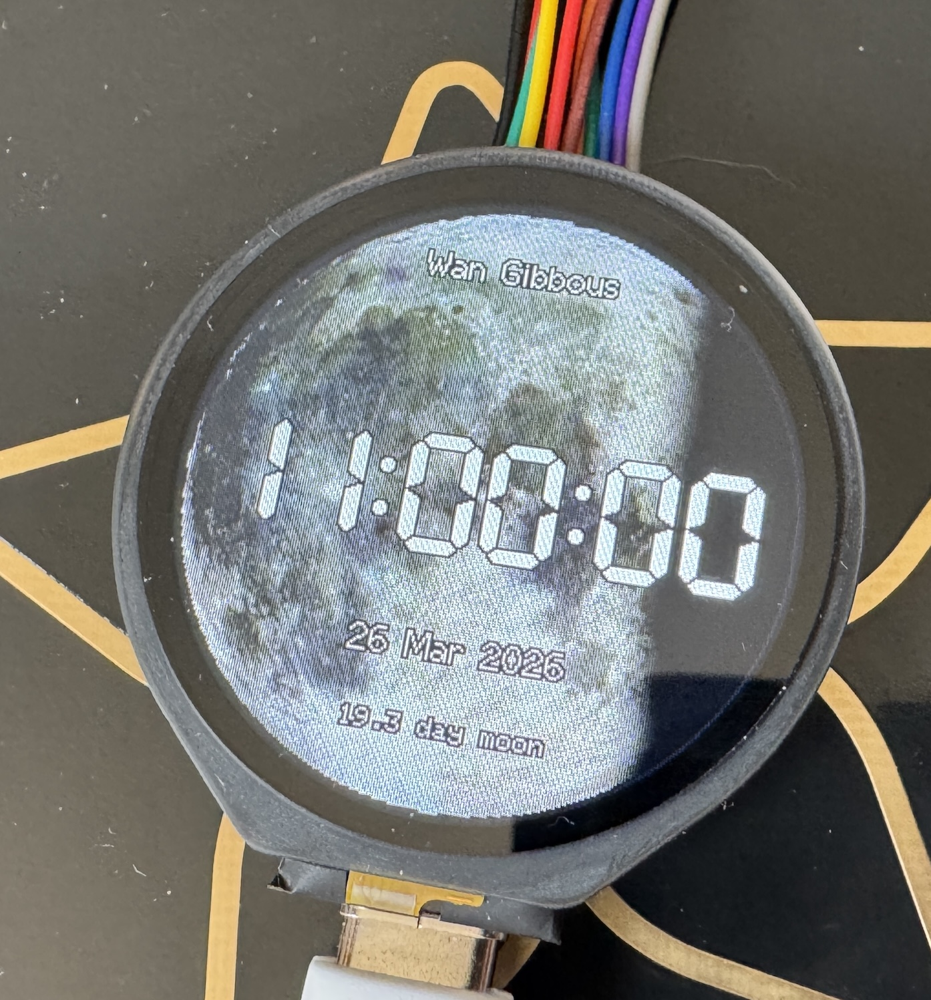
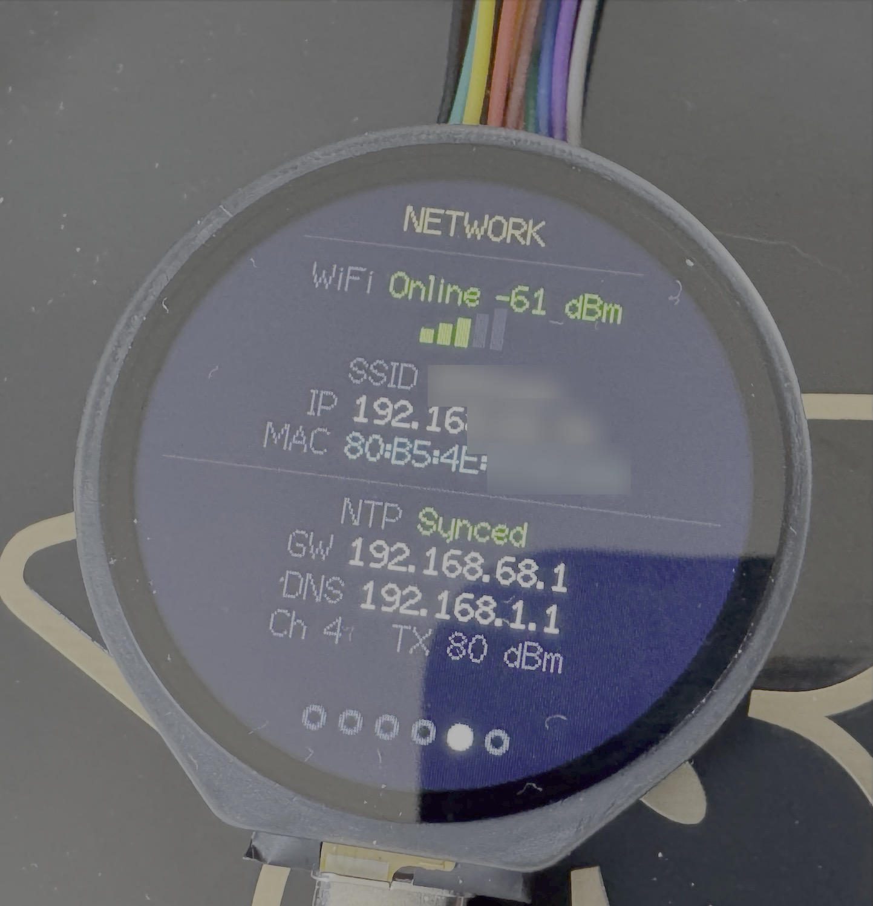
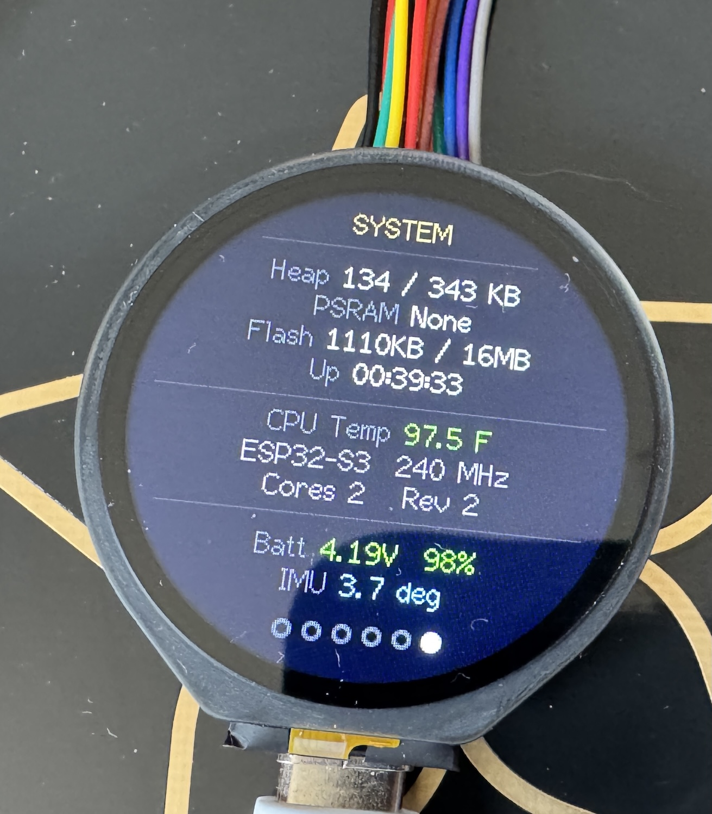

# Round ESP32 Playground

A feature-rich clock firmware for the **Waveshare ESP32-S3-Touch-LCD-1.28** — a 240×240 round IPS display with capacitive touch, WiFi, and an onboard IMU.

Six swipeable pages are rendered into a 240×240 sprite and pushed to the display at up to 50 Hz, with per-second redraws on clock pages and NTP-synchronised time.

---

## Hardware

| Component | Detail |
|-----------|--------|
| SoC | ESP32-S3R8 — dual-core 240 MHz, 512 KB SRAM, 2 MB OPI PSRAM, 16 MB Flash |
| Display | GC9A01A 240×240 round IPS, SPI |
| Touch | CST816S capacitive, I2C (polling mode) |
| IMU | QMI8658 6-axis, I2C — accelerometer read for tilt angle on System page |
| Battery ADC | GPIO1 through 200 kΩ / 100 kΩ divider → V_bat = V_adc × 3 |

---

## Pages

Swipe left/right to navigate between pages.

| # | Name | Description |
|---|------|-------------|
| 0 | Phantom Diver | Dark navy dial, luminous markers, 5-layer silver hands, red second |
| 1 | Ocean | Deep blue radial gradient, gold border, white baton markers, gold second |
| 2 | Moon Analog | Real moon photo background, terminator shading driven by actual date, analog hands |
| 3 | Moon Digital | Same moon background, 12-hour HH:MM:SS centred on the disc |
| 4 | Diag: Network | WiFi status + RSSI bars, SSID, IP, MAC, NTP, gateway, DNS, channel, TX power |
| 5 | Diag: System | Heap, PSRAM, flash, uptime, CPU temp (°F), chip info, battery V + %, IMU tilt angle |

Both diagnostics pages auto-refresh every 2 seconds. All text is laid out using `textWidth()`-based centering so nothing clips against the circular bezel.

---

## Screenshots

| Moon Digital | Diag: Network | Diag: System |
|:---:|:---:|:---:|
|  |  |  |

---

## Features

- **NTP time sync** — connects to `pool.ntp.org` on boot; daily refresh; Eastern timezone with auto-DST (configurable in `config.h`)
- **Real moon phase** — Julian Day calculation gives the correct lunar phase for any date; terminator line rendered with a 24-pixel smoothstep penumbra and earthshine glow on the dark side
- **Transparent text** — all text on the moon faces uses a per-pixel transparency technique (no opaque background boxes)
- **Double-buffered rendering** — 240×240 16-bit sprite in PSRAM; `pushSprite()` for tear-free updates
- **IMU tilt angle** — QMI8658 accelerometer initialised on first visit to the System page; displays tilt from horizontal in degrees (or "Offline" if not detected)
- **Serial diagnostics** — reset reason on boot, 5-second heartbeat, WiFi reconnect every 30 s

---

## Setup

### 1. Install dependencies

- **TFT_eSPI** by Bodmer — install via Arduino Library Manager

### 2. Configure the board

In Arduino IDE set:

| Setting | Value |
|---------|-------|
| Board | ESP32S3 Dev Module |
| PSRAM | OPI PSRAM |
| USB CDC on Boot | Disabled |
| Flash Size | 16MB |
| CPU Frequency | 240 MHz |

> **Why "Disabled"?** With USB CDC on Boot disabled, `Serial` maps to UART0 (GPIO 43/44), which is the same port that shows the ROM bootloader output. This makes serial monitoring simpler — one port, one cable.

### 3. Add WiFi credentials

Copy `secrets.h.example` to `secrets.h` and fill in your network details:

```cpp
#define WIFI_SSID     "your-network-name"
#define WIFI_PASSWORD "your-password"
```

`secrets.h` is listed in `.gitignore` and will never be committed.

### 4. Flash

Select the correct serial port and click Upload.

---

## File Structure

| File | Purpose |
|------|---------|
| `Round_ESP32_Playground.ino` | Main sketch — setup, loop, WiFi, NTP, page dispatch |
| `config.h` | TFT_eSPI pin/driver defines, board pin map, NTP config, page IDs |
| `secrets.h` | WiFi credentials — **not committed, copy from `secrets.h.example`** |
| `secrets.h.example` | Template for secrets.h |
| `clock_faces.h` | Phantom Diver (Face 1) and Ocean (Face 2) clock faces; shared drawing helpers |
| `clock_face_moon.h` | Moon Analog (Face 3) and Moon Digital (Face 4); moon phase math; terminator |
| `moon_image.h` | 240×240 RGB565 full-moon photo as a PROGMEM array (generated by `images/convert_image.py`) |
| `page_diagnostics.h` | Network diagnostics page (p4) and System diagnostics page (p5); QMI8658 IMU driver |
| `touch_cst816s.h` | CST816S I2C polling driver |
| `images/` | Source moon photo and Python conversion script |

---

## Regenerating the Moon Image

If you want to use a different moon photo:

1. Replace `images/Full_moon_240x240.jpg` with a 240×240 JPEG
2. Run the converter:
   ```bash
   cd images
   python3 convert_image.py
   ```
3. The script writes a new `moon_image.h` to the project root

---

## Serial Output

Connect a serial monitor at **115200 baud** to the UART port (GPIO 43 TX / GPIO 44 RX).

Expected output on boot:
```
╔══ ESP32-S3 Round Display ════════════════════╗
  Reset : PowerOn
  Sprite OK  (1843200 bytes free heap)
  Touch: CST816S chip ID: 0xB4
  WiFi:
    Connecting to "MyNetwork"....
    IP    : 192.168.1.42
  NTP:
    NTP synced: 14:32:07 03/25/2026
╚═══════════════════════════════════════════════╝
```

Every 5 seconds thereafter:
```
[   10s] page=0  heap=183244  wifi=OK(-62dBm)
```
